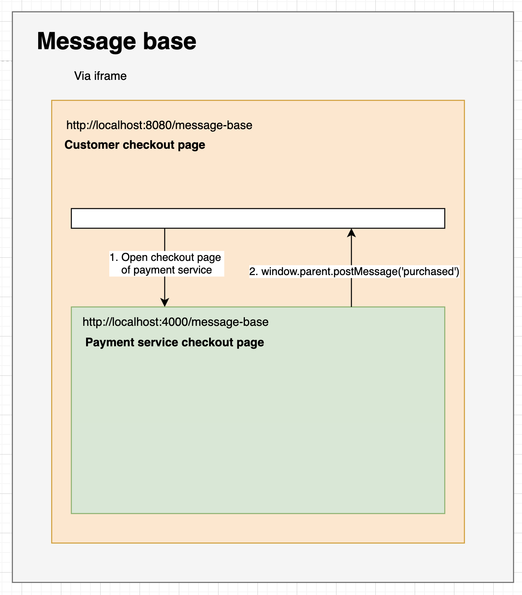
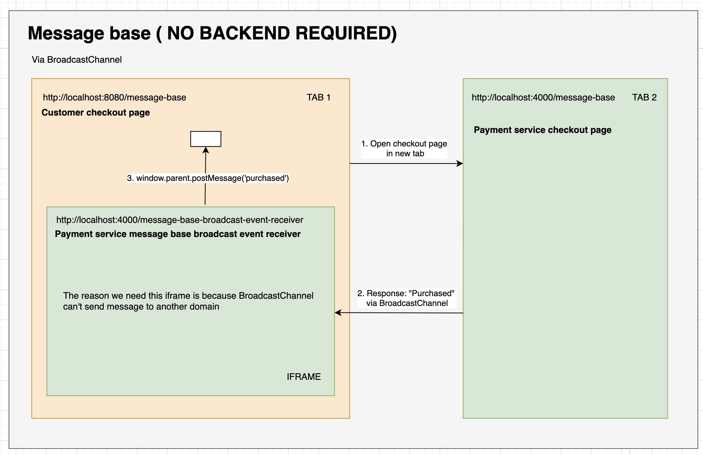
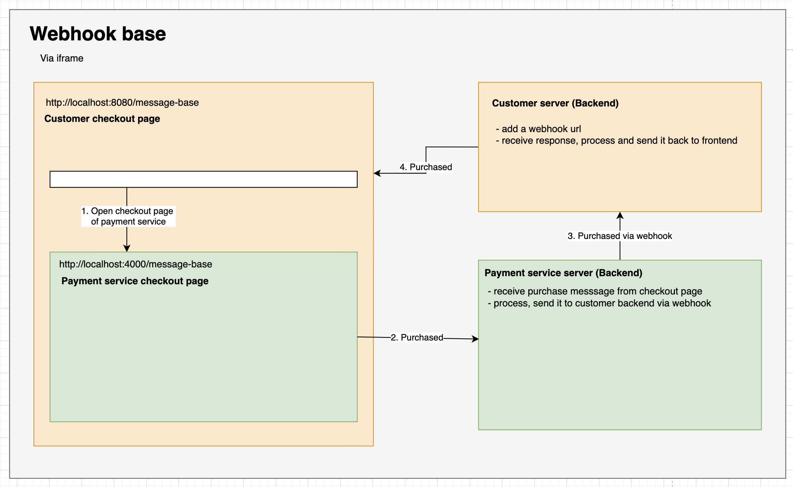

# hosted-page-payment-experience
Sharing about HPP experience of Paypal, Clover, Stripe, Square, Nuvei, Klanar,..

1. Message base
   
    With message base solution, the customer just need a website (no backend is required).
    Conversation between Payment service checkout page and customer website is base on message: 
     + window.parent.postMessage if checkout page show in an iframe.
     + BroadcastChannel + window.parent.postMessage if checkout page show in another tab.

2. Webhook base
 + In webhook base solution, customer need to host a backend app which will be listening for request send from payment provider. 
   It'll increase the complexity for development progress because the dev usually using localhost to test the app.
   Another work-around is use reverse proxy server (Ngrok, Serveo, etc.) to public localhost website.
 + The customer need to define webhook URL so the payment provider can send the data to it. 
 

### ROADMAP
- Complete webhook example.
- Add complex use cases: Pre-auth, Sale, Capture, Void, Refund
- ...
